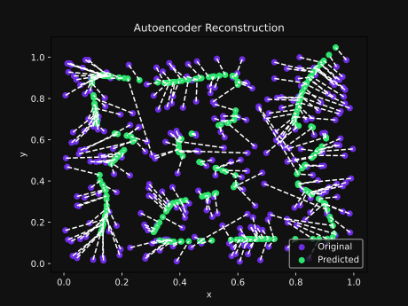

# neural-spatial-curves
Like Hilbert Curves but with a basic autoencoder.

Code generated by [DeepSeel-R1:7b](https://github.com/deepseek-ai/DeepSeek-R1) and touched up by [Mauve](https://github.com/RangerMauve/) and [Qwen2.5-coder:3b/7b](https://github.com/QwenLM/Qwen2.5-Coder)

## Running

This project uses [python virtualenv](https://virtualenv.pypa.io/en/latest/user_guide.html) for dependency management. Styling is put through [autopep8](https://pypi.org/project/autopep8/) for consistency.

Use `source env_name/bin/activate` to activate it and `pip install -r requirements.txt` to install the dependencies.

From there you can run the model with `python neural_curve.py`

